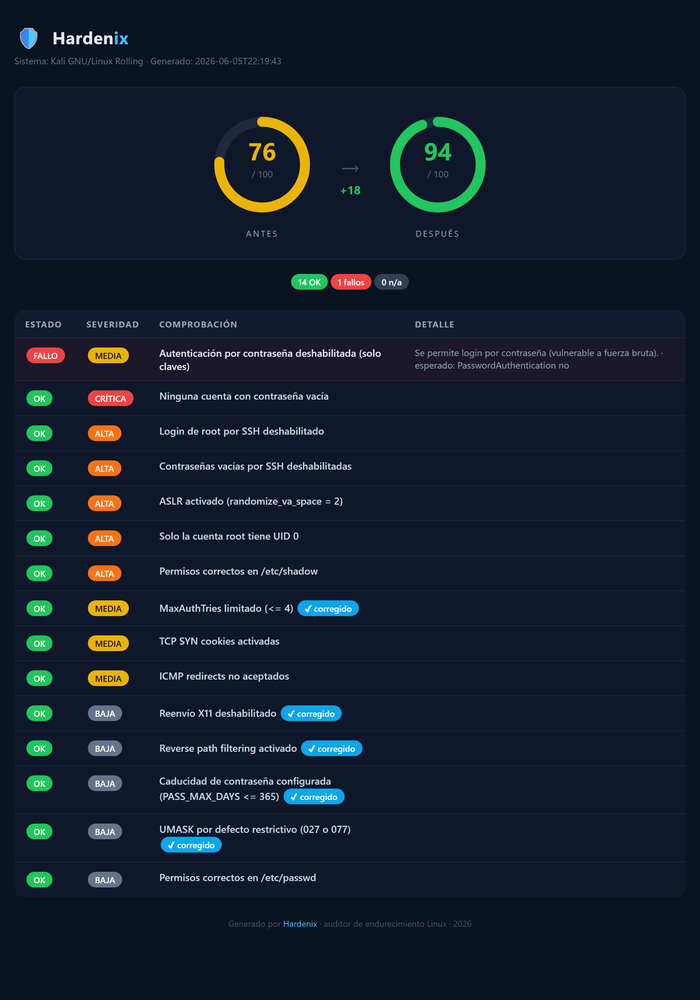
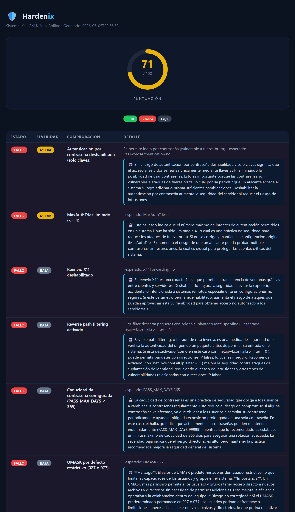
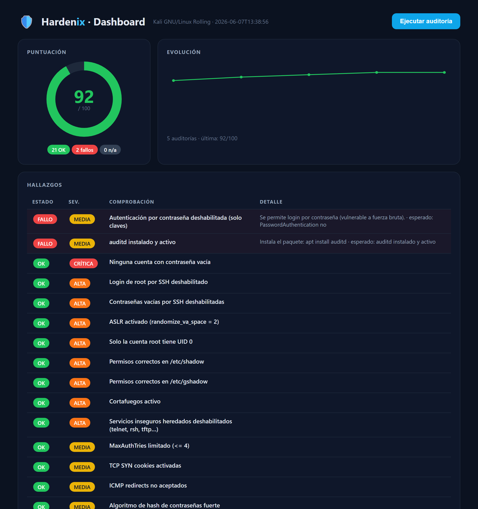

# 🛡️ Hardenix

**Auditor y endurecedor de seguridad para Linux** — escanea tu sistema contra buenas prácticas (estilo CIS Benchmark), te da una **puntuación de seguridad**, y (próximamente) **corrige** lo inseguro con copia de seguridad y *rollback*.

No es "otro script de checks": el objetivo es **auditar → puntuar → arreglar → volver a puntuar**, con informe antes/después y explicaciones en lenguaje claro.

📄 **[Presentación del proyecto (PDF)](docs/Hardenix-Proyecto.pdf)** — qué hace, cómo funciona, instalación y proceso.



```
  HARDENIX  ·  auditoría de endurecimiento Linux
  Sistema: Kali GNU/Linux Rolling

  [FALLO]  MEDIA    Autenticación por contraseña deshabilitada (solo claves)
          actual:   PasswordAuthentication yes
          esperado: PasswordAuthentication no
  [ OK ]  ALTA     ASLR activado (randomize_va_space = 2)
  ...

  8 OK   6 fallos   1 n/a
  Puntuación de seguridad:  71/100
  █████████████████████░░░░░░░░░
```

## ¿Por qué es diferente?

La mayoría de auditores (Lynis, etc.) solo **avisan**. Hardenix busca:

- ✅ **Auditoría con puntuación** ponderada por severidad.
- 🔧 **Remediación con rollback** — aplica el *fix* y guarda copia para deshacer.
- 📊 **Informe antes/después** (terminal + HTML) — ideal para demostrar mejora.
- 🤖 **Explicaciones con IA local** (vía LM Studio) — cada fallo explicado en español, sin enviar datos a la nube.
- 🐧 Pensado para **multi-distro** (Debian/Ubuntu y RHEL).

## Qué comprueba

Cerca de 30 comprobaciones (estilo CIS Benchmark), con detección **multi-distro**
(Debian/Ubuntu y RHEL/Fedora):

| Categoría | Ejemplos |
|-----------|----------|
| **SSH** | login de root, solo-claves, `MaxAuthTries`, `LoginGraceTime`, `StrictModes`, X11, contraseñas vacías |
| **Kernel (sysctl)** | ASLR, SYN cookies, ICMP redirects, *reverse path filtering* |
| **PAM** | complejidad de contraseña (pwquality/cracklib), historial (pwhistory), bloqueo por fuerza bruta (faillock/tally2) |
| **Cuentas** | caducidad mín./máx. de contraseña, `UMASK`, algoritmo de hash, contraseñas vacías, UID 0 único |
| **Permisos** | `/etc/shadow`, `/etc/gshadow`, `/etc/passwd`, `/etc/group` |
| **Red** | cortafuegos activo (ufw/firewalld/nftables/iptables) |
| **Servicios** | servicios heredados en texto plano (telnet, rsh, tftp, finger) |
| **Auditoría** | `auditd` instalado y activo |
| **Parches** | actualizaciones de seguridad pendientes (apt/dnf) |

## Uso

Requiere Python 3.8+. La auditoría base **no necesita dependencias**.

```bash
# Auditar el sistema
python3 -m hardenix audit

# Salida en JSON (para integrar en otras herramientas)
python3 -m hardenix audit --json

# Ver qué corregiría (vista previa, no cambia nada)
sudo python3 -m hardenix fix

# Aplicar las correcciones (respalda cada cambio antes)
sudo python3 -m hardenix fix --yes

# Incluir también fixes con riesgo de bloqueo (p. ej. SSH solo-claves)
sudo python3 -m hardenix fix --yes --incluir-riesgo

# Deshacer el último conjunto de cambios
sudo python3 -m hardenix rollback --yes
sudo python3 -m hardenix rollback --list        # ver snapshots

# Informe HTML (abre el .html en el navegador)
python3 -m hardenix audit --html informe.html

# Informe con comparativa antes/después en un solo paso:
sudo python3 -m hardenix fix --yes --report informe.html

# O guardando un baseline para comparar más tarde:
python3 -m hardenix audit --json > antes.json
python3 -m hardenix report --baseline antes.json --output informe.html

# Con explicaciones generadas por un LLM local (LM Studio):
python3 -m hardenix audit --ai
python3 -m hardenix audit --ai --html informe.html
```

### IA local (opcional)

Con `--ai`, Hardenix pide a un **LLM local** (vía LM Studio o cualquier servidor
compatible con la API de OpenAI) que explique cada fallo en español: qué es, por
qué importa y el riesgo real. **Todo ocurre en tu máquina — nada se envía a la nube.**

1. Abre **LM Studio**, descarga y carga un modelo.
2. Ve a la pestaña *Developer / Local Server* y pulsa **Start Server** (escucha en `http://localhost:1234`).
3. Ejecuta Hardenix con `--ai`. Si el servidor no está activo, la auditoría
   continúa con normalidad sin las explicaciones.

```bash
# Apuntar a otro endpoint o modelo
python3 -m hardenix audit --ai --ai-url http://localhost:1234/v1 --ai-model mistral-7b-instruct
```

> ¿Ejecutas Hardenix en **WSL** con LM Studio en **Windows**? Por defecto no se
> alcanza `localhost` entre ellos. Consulta [docs/IA-LOCAL-WSL.md](docs/IA-LOCAL-WSL.md)
> (incluye un script-puente `scripts/wsl-lmstudio-bridge.py`).



## Dashboard web

Un panel local (servidor de la librería estándar, **sin dependencias**) con la
puntuación en vivo, el **historial de auditorías** y la **evolución del score**
en el tiempo.

```bash
python3 -m hardenix serve            # http://127.0.0.1:8080
```



> Ejecútalo con `sudo` para que apliquen todos los checks y se puedan escribir
> los cambios. Por seguridad, `fix` **solo previsualiza** salvo que añadas `--yes`,
> y omite los fixes peligrosos salvo `--incluir-riesgo`.

## Hoja de ruta

- [x] **Fase 1** — Motor de checks, scoring e informe en terminal
- [x] **Fase 2** — Remediación automática con copia de seguridad y *rollback*
- [x] **Fase 3** — Informe HTML con comparativa antes/después
- [x] **Fase 4** — Explicaciones con IA local (LM Studio)
- [x] **Fase 5** — Más checks (firewall, servicios, auditd, parches) y multi-distro
- [x] **Fase 6** — Dashboard web con historial y evolución del score

## Aviso

Hardenix modifica configuración de seguridad del sistema. Pruébalo siempre primero
en una máquina de pruebas o VM. El autor no se responsabiliza de un uso indebido.

## Licencia

MIT © Óscar Carretero Hilillo
